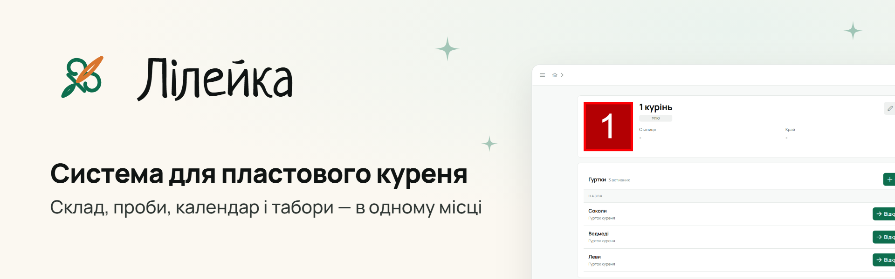

<picture>
  <source media="(prefers-color-scheme: dark)" srcset=".github/assets/banners/readme-dark.png">
  
</picture>

# Лілейка

Система для пластового куреня: склад, проби й вмілості, календар і задачі, планування табору,
звіт куреня. Працює в хмарі або на сервері станиці.

Незалежний проєкт, не офіційний ресурс НСОУ «Пласт». Зроблено пластуном для пластунів.

**[Довідка](https://projectk-docs-and-demo.pages.dev/)** ·
**[Демо](https://projectk-docs-and-demo.pages.dev/demo/)** ·
**[Приєднати курінь](https://projectk.rostyslav-mukha.dev/join)** ·
**[Власний сервер](https://projectk-docs-and-demo.pages.dev/user/self-host/)** ·
**[Релізи](https://github.com/iamavasya/Project-K/releases)**

[](https://github.com/iamavasya/Project-K/releases)
[](https://github.com/iamavasya/Project-K/actions/workflows/dotnet.yml)
[](https://github.com/iamavasya/Project-K/actions/workflows/angular.yml)

## Документація

Уся документація — на сайті: [для користувачів](https://projectk-docs-and-demo.pages.dev/) і
[для розробників](https://projectk-docs-and-demo.pages.dev/dev/) — архітектура, запуск, сутності,
міграції, власний сервер, DevLog. Джерела лежать у `docs/`, сайт збирається з `site/`.

## Запуск для розробки

Потрібні .NET 10 SDK, Node ≥ 22.22.3 і Docker.

```bash
./scripts/dev.sh tools up          # спільні SQL і Azurite, один раз
./scripts/dev.sh up dev --build    # застосунок на http://localhost:4200, API на 5205
```

Перед змінами: [`CONTRIBUTING.md`](CONTRIBUTING.md) — конвенції,
[`ARCHITECTURE.md`](ARCHITECTURE.md) — з чого складається система,
[`BRANDBOOK.md`](BRANDBOOK.md) §0 — перед будь-якою зміною інтерфейсу.

## Повідомити про проблему

У застосунку — кнопка **«Повідомити про проблему»** внизу бічного меню. Про вразливість —
приватно, за [`SECURITY.md`](SECURITY.md).

## Назва й ліцензія

Продукт — **Лілейка**; репозиторій, образи Docker і CI — **ProjectK**.
Код публічний, ліцензія — пропрієтарна: див. [`LICENSE`](LICENSE).
