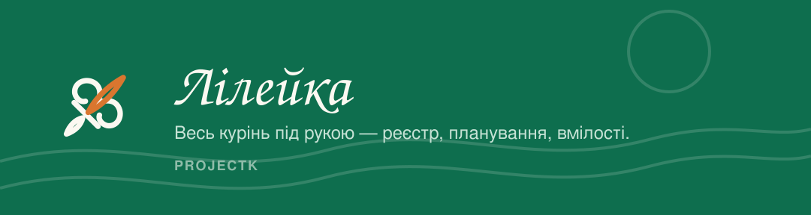

# ProjectK


[](https://github.com/iamavasya/Project-K/actions/workflows/dotnet.yml)
[](https://github.com/iamavasya/Project-K/actions/workflows/angular.yml)

**ProjectK** is the codebase behind **Лілейка** — a management system for a Plast
(Ukrainian scouting) *kurin*: the whole unit in one place — member registry,
planning, and skills tracking. Built by scouts, for scouts.

> Naming: the product/UI is **Лілейка**; the repository, Docker images, and CI
> are **ProjectK**. See [`BRANDBOOK.md`](BRANDBOOK.md) §0.

## Features

- **Members** — registry with profiles, photos, Plast levels, warnings and awards, scoped by kurin/gurtok.
- **Probes & badges («проба», «вмілості»)** — progress tracking, submission and review workflows.
- **Agenda** — a shared calendar and a task board over the same items, with scoped "assign-for" (kurin → gurtok → member).
- **Notifications** — an in-app inbox for verifications, agenda changes, reviews and leadership changes.
- **Roles & access** — Admin / Manager / Mentor / User plus leadership positions (курінний, гуртковий …), enforced by a resource-scoped authorization layer.
- **Security** — geo-blocking via Cloudflare header, privileged-MFA enforcement, login/MFA monitoring.
- **Self-hostable** — a Docker bundle ships with every release.

## Tech stack

- **Backend:** .NET 10, ASP.NET Core, EF Core (SQL Server), MediatR pipeline, Serilog → Application Insights.
- **Frontend:** Angular (standalone), PrimeNG + Tailwind, custom "Лілейка" theme.
- **Storage:** Azure Blob Storage (Azurite locally) for photos/media.
- **Hosting:** Azure App Service (API) + Azure Static Web Apps (web); Cloudflare in front.

## Quickstart

### Self-host (Docker)

Every release attaches a self-host bundle. See
[`docs/self-host/README.md`](docs/self-host/README.md) for the full guide.

```bash
cd docker/selfhost
cp .env.example .env   # set secrets and app name
docker compose -f compose.yml up -d
```

The stack runs the API, web, SQL Server 2022 and Azurite together.

### Local development

Prerequisites: **.NET 10 SDK**, **Node 22**, and Docker (for SQL + Azurite).

```bash
# one-shot dev environment (SQL, Azurite, API, web)
./scripts/dev.sh            # bash
./scripts/dev.ps1           # PowerShell
```

Or run the pieces directly:

```bash
# backend
dotnet run --project Backend/ProjectK.Backend/ProjectK.API

# frontend
cd Frontend/projectk-frontend && npm ci && npm start
```

## Repository layout

```
Backend/ProjectK.Backend/   .NET solution (API, BusinessLogic, Infrastructure, Common, tests)
Frontend/projectk-frontend/ Angular app (brand assets in public/assets/)
docker/                     compose stacks, nginx, env templates, self-host bundle
scripts/                    dev / start / stop / doctor / migration-bundle helpers
docs/                       self-host guide, planning docs
BRANDBOOK.md                visual system (read §0 before any UI change)
```

## Links

- [Releases](https://github.com/iamavasya/Project-K/releases)
- [Brand assets](Frontend/projectk-frontend/public/assets/README.md)
- [Self-host guide](docs/self-host/README.md)
