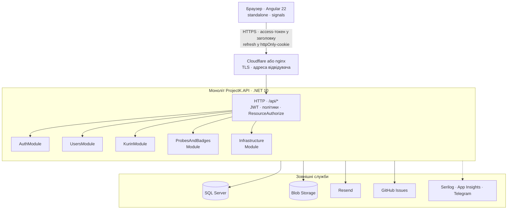
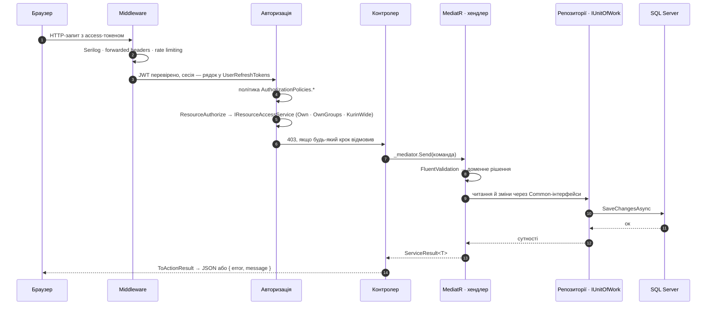
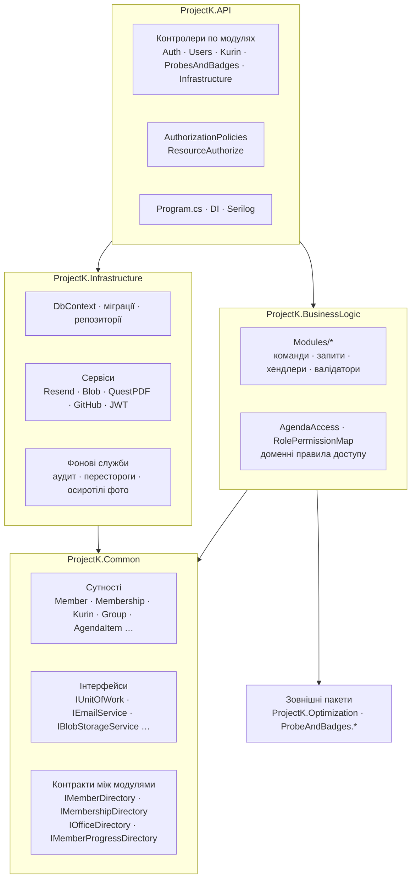
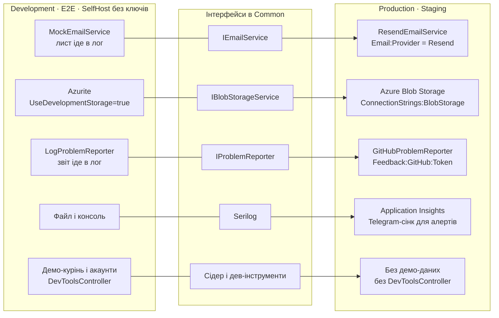

Лілейка — **модульний моноліт**: один процес `.NET`, одна база, один образ на всі середовища, але
всередині пʼять модулів із контрактами між ними, які колись можна винести окремо. Словами це
описано в [Архітектурі](/dev/core/architecture/); тут ті самі речі намальовані. Діаграми
підлаштовуються під ширину екрана і тему сайту.

## 1. Клієнт і сервер

Браузер тримає Angular-застосунок і ходить до одного API. Усе, що API потрібно ззовні, стоїть
праворуч: база, сховище файлів, пошта, GitHub для звітів про проблеми, логи.

Фронтенд і сайт довідки — окрема статика зі своїм деплоєм; API нічого не рендерить.

## 2. Шлях запиту

Що відбувається з одним `PUT`, поки він стане відповіддю. Два кроки авторизації розділені
навмисно: політика каже, чи людина взагалі такого рівня, `ResourceAuthorize` — чи саме цей
обʼєкт у її сфері.

Контролер не приймає рішень: усе, що він робить, — `_mediator.Send(...)` і переклад
`ServiceResult<T>` у HTTP в одному місці, `ServiceResultExtensions.ToActionResult`.

## 3. Шари й модулі всередині моноліту

Чотири проєкти з односторонніми залежностями. `BusinessLogic` та `Infrastructure` не знають одне
про одного: інтерфейс живе в `Common`, реалізація — в `Infrastructure`. Модулі не читають таблиць
одне одного, а питають через контракти в `Common/Interfaces/Modules/`; `ProjectK.Architecture.Tests`
читає IL і валить збірку, якщо хтось перетнув межу.

Модулі однакові по обидва боки межі: `BusinessLogic/Modules/AuthModule` і
`API/Controllers/AuthModule` — про одне й те саме. Мембер від початку будувався так, щоб його
можна було винести в окремий сервіс: контракт замість репозиторію, ключ замість навігації.

## 4. Прод і локальні заглушки

Один образ, середовище обирається через `ASPNETCORE_ENVIRONMENT`, а зовнішні служби — через
конфігурацію. Вибір робиться один раз на старті, тож локальний стек чи self-host без ключів не
падає в момент, коли треба надіслати лист або створити issue.

| Що перемикає | Ключ | Прод | Локально |
|---|---|---|---|
| Пошта | `Email:Provider` | `Resend` (`Email:ApiKey`) | будь-що інше → `MockEmailService` |
| Файли | `ConnectionStrings:BlobStorage` | рядок Azure | порожньо → `UseDevelopmentStorage=true` (Azurite) |
| Звіти про проблеми | `Feedback:GitHub:Token` | є → GitHub Issues | нема → лог |
| Демо-дані | `ASPNETCORE_ENVIRONMENT` | `Production`, `Staging`, `SelfHost`, `Tailscale`: нічого | `Development`, `E2E`: демо-курінь, стирається при старті |
| Дев-контролери | `ASPNETCORE_ENVIRONMENT` | знімаються з моделі | `Development`, `E2E`, `Tailscale` |

`SelfHost` живе між двома колонками: заглушки вмикаються не середовищем, а відсутністю ключа, тож
станиця може поставити систему без пошти й GitHub і додати їх пізніше, не міняючи образ.
