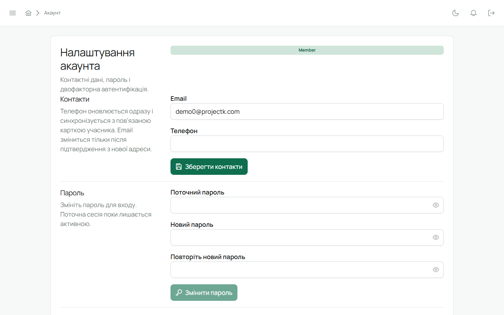

«Налаштування акаунта» у сайдбарі.

## Профіль

Імʼя, прізвище, пошта. Зміна пошти вимагає поточного пароля і підтверджується листом на нову
адресу. Картка учасника підтягує нову пошту сама.

## Пароль

Поточний пароль → новий (від 8 символів). Після зміни всі інші сесії на інших пристроях
завершуються, і довірені пристрої для MFA доведеться підтвердити знову.

## Двофакторний вхід (MFA)

Для Звʼязкового й адміністратора обовʼязковий, для решти — за бажанням.

- **Увімкнути:** QR-код → застосунок-автентифікатор → шестизначний код → збережи резервні коди.
- **Довірений пристрій:** після вдалого коду цей браузер запамʼятовується на 7 днів. Вихід і
  вхід протягом тижня коду не вимагають; інший пристрій — з кодом.
- **Резервні коди:** кожен діє один раз. «Оновити резервні коди» видає новий набір і скасовує
  старий (потрібен поточний пароль).
- **Вимкнути:** поточний пароль і код. Провід куреня вимкнути не може, поки тримає уряд.

## Втратив доступ

- **Забув пароль** — «Забули пароль?» на сторінці входу, лист прийде на пошту акаунта. Якщо акаунт
  ще не активований, так само прийде нове запрошення.
- **Загубив телефон з автентифікатором** — увійди резервним кодом і одразу увімкни MFA заново з
  новим застосунком.
- **Немає ні телефона, ні кодів** — звернися до адміністратора системи: він може призупинити акаунт
  і допомогти з відновленням.

## Сесії

Вхід на кожному пристрої — окрема сесія. «Вийти» завершує лише поточну; зміна пароля або
скидання MFA завершує всі.

## Тема

Перемикач світлої й темної теми — угорі. Вибір зберігається на пристрої.
