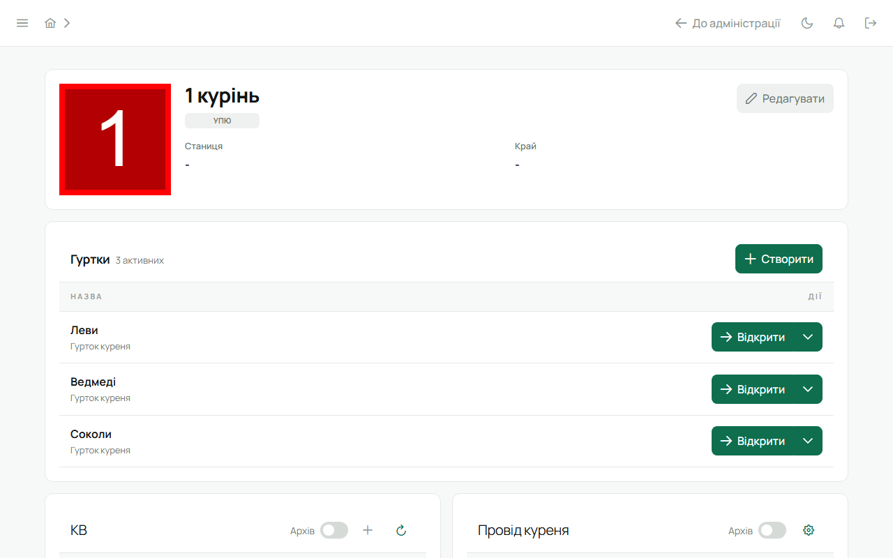

Адміністратор не належить куреню. Після входу він потрапляє в «Адміністрацію»: перелік куренів,
заявки, користувачі, системні налаштування. Щоб подивитися курінь зсередини, натисни «Відкрити» —
і працюй у ньому як провід; «До адміністрації» повертає назад.

## Заявки

Заявки від Звʼязкових зі сторінки «Приєднатися». Для кожної: імʼя, контакти, станиця, число куреня.

- **Схвалити** — створює курінь із цим числом і акаунт Звʼязкового, надсилає запрошення листом.
- **Відхилити** — заявка закривається.
- **Надіслати ще раз** — нове запрошення, якщо попереднє прострочилось або загубилось.

Перш ніж схвалити, варто переконатися, що людина справді Звʼязковий цього куреня — телефоном чи
через станицю.

## Користувачі

Усі акаунти системи: пошта, імʼя, системна роль (Адміністратор / Учасник), курінь.

- **Роль** — зробити людину адміністратором або зняти. Уряди в курені тут не міняються.
- **Призупинити / відновити** — призупинений акаунт не може увійти; сесії завершуються одразу.
  Це для втраченого доступу чи спірної ситуації, а не для виходу з куреня.

## Курені

Створити курінь напряму (без заявки), відкрити будь-який, видалити порожній.

## Системні налаштування

- **Обовʼязкова MFA для проводу.** У хмарній інсталяції завжди увімкнена; на власному сервері —
  вирішує власник.
- Інші глобальні перемикачі системи.

## Публічні анонси

Якщо увімкнені — чернетки анонсів проходять модерацію тут; терракотова крапка в сайдбарі каже,
що є що розглянути.

## Безпека адміністратора

Двофакторний вхід обовʼязковий. Резервні коди — окремо від телефона. Дії адміністратора
пишуться в журнал аудиту.
