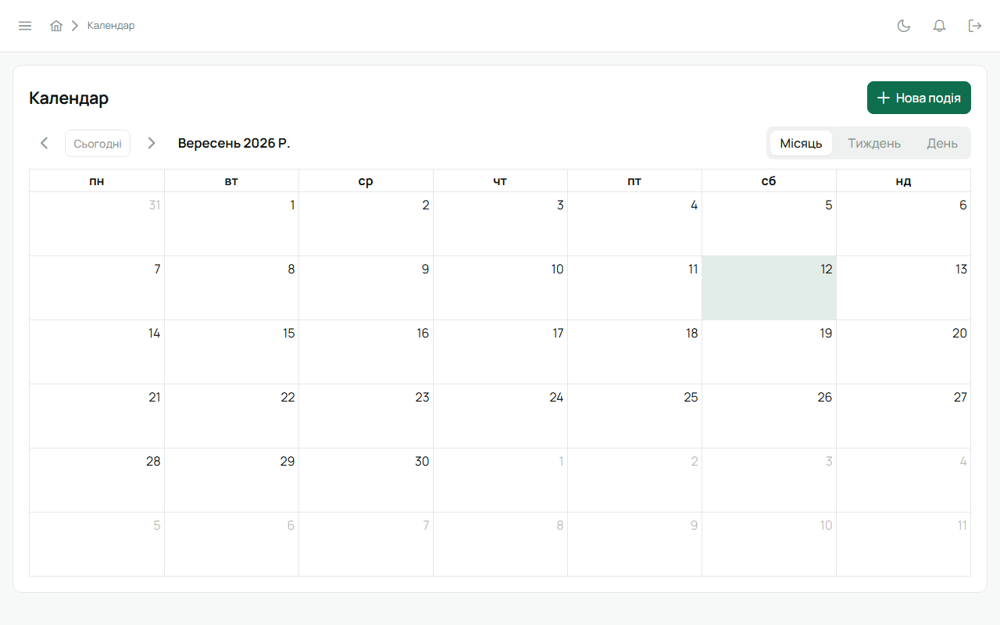
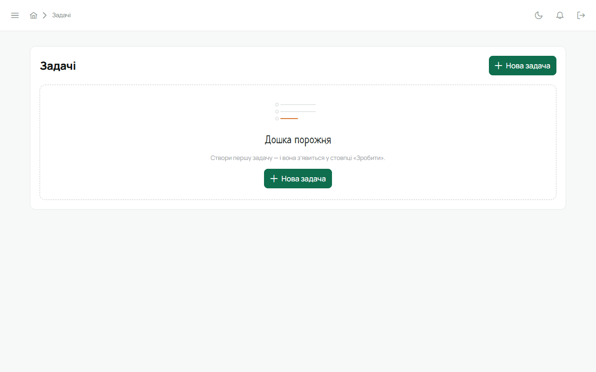

Календар і задачі працюють над одними й тими самими подіями: те, що створено як подія, можна
бачити і в місячному календарі, і як задачу на дошці.

## Календар

«Календар» у сайдбарі: місяць або погодинний тиждень. Події позначені групою — табори, заходи,
сходини (групи налаштовує Звʼязковий у налаштуваннях куреня).

**Створити подію** може впорядник для свого гуртка і провід куреня для всього куреня. У формі:
назва, час, місце, група, **для кого** — курінь, гуртки або конкретні люди, **повтор** (наприклад,
сходини щосуботи), опис.

Кожен, кого стосується подія, бачить її у себе і може відповісти **«буду / не буду»**; організатор
бачить, хто відповів.

## Задачі

«Задачі» — дошка задач куреня: для гуртка, для куреня або персональні. Виконавець, термін, стан.
Юнак бачить лише те, що призначено йому чи його гуртку.

## З планування в подію

Дата табору, підібрана у [Плануванні](/user/features/planning/), одним кліком стає подією
календаря з групою «табори».

## Сповіщення

Про нову подію чи задачу, що стосується тебе, і про зміни в них приходить сповіщення (дзвіночок
угорі).
