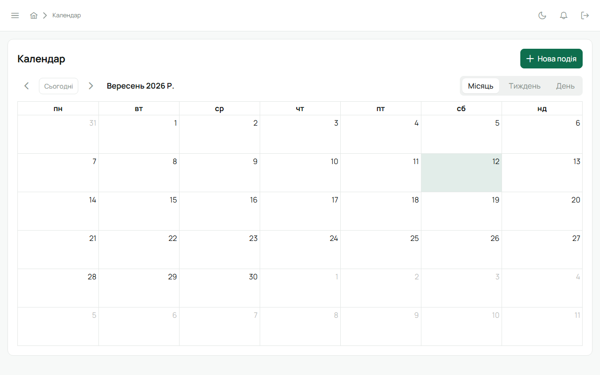
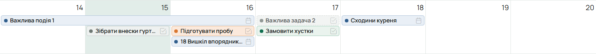
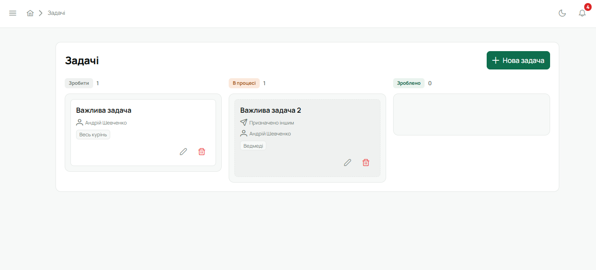

Календар і задачі працюють над одними й тими самими подіями: те, що створено як подія, можна
бачити і в місячному календарі, і як задачу на дошці.

## Календар

«Календар» у сайдбарі: місяць або погодинний тиждень. Події позначені групою — табори, заходи,
сходини (групи налаштовує Звʼязковий у налаштуваннях куреня).

**Створити подію** може впорядник для свого гуртка і провід куреня для всього куреня. У формі:
назва, час, **де** (домівка, мала кімната, парк), група, **для кого** — курінь, гуртки або конкретні люди, **повтор** (наприклад,
сходини щосуботи), опис.

**Графіки гуртків.** Групу подій (наприклад, «Сходини») Звʼязковий може позначити як
**«Графік куреня»** — тоді її події бачить увесь курінь, а не лише ті, кому вони призначені: юнак
бачить, коли сходини в кожного гуртка. Чужі сходини в календарі бліді, з назвою гуртка
(«Кельти · Сходини»), і на них не треба відповідати — це лише графік. Перемикач **«Графіки
гуртків»** над календарем ховає їх, якщо хочеш бачити тільки своє.

Кожен, кого стосується подія, бачить її у себе і може відповісти **«йду / можливо / не йду»**; організатор
бачить, хто відповів.

## Задачі

«Задачі» — дошка задач куреня: для гуртка, для куреня або персональні. Виконавець, термін, стан.
Юнак бачить лише те, що призначено йому чи його гуртку.

### Пошук, фільтри й архів

Над дошкою — **пошук** (за назвою, описом чи гуртком), фільтр **для кого**, **сортування** (за
терміном, нещодавно змінені, нові, за назвою) і перемикач **«Моє»** — лише задачі, де щось
робити саме тобі. Число біля колонки — скільки в ній задач під фільтром; якщо їх більше, ніж
видно, внизу колонки є **«Завантажити ще»**.

Зроблені задачі не лишаються на дошці назавжди: через **30 днів** після закриття вони самі
переходять в **«Архів»** (кнопка над дошкою), а з архіву через **365 днів** видаляються
назавжди. Обидва строки Звʼязковий змінює чи вимикає в налаштуваннях куреня → «Архів задач».
Задачу можна перенести в архів і раніше — кнопкою на картці, а з архіву — знайти й **повернути**.

### Як виконується задача для гуртка

Коли задача йде гуртку, куреню чи проводу, у формі є поле **«Як виконується»**:

| Спосіб | Коли брати | Хто закриває |
|---|---|---|
| **Одна на всіх — закриває провід** (типово) | «Підготувати звіт гуртка» | гуртковий, провід гуртка чи впорядник |
| **Одна на всіх — закриває будь-хто** | «Принести ватру на сходини» | будь-хто з гуртка; видно, хто саме |
| **Кожному окремо** | «Здати вкладку», «Принести довідку» | кожен свою частину; провід може відмітити за когось |

У «кожному окремо» на картці видно, скільки вже зробили («5 з 8»), а гуртковий у деталях задачі
бачить поіменно, хто ще ні, і може поставити позначку за юнака, який, наприклад, віддав вкладку
готівкою, — тоді видно, хто саме поставив. Задача зроблена, коли зробили всі, хто зараз у гуртку:
новий юнак теж бачить її у «Зробити».

Задача трьом гурткам має стан для кожного: гурток, який закрив, бачить її в «Зроблено», решта —
далі у своїх колонках. Біля зробленого завжди написано, хто закрив і коли.

Спосіб виконання можна змінити, лише поки ніхто нічого не відмітив. Потім — тільки новою задачею,
інакше чиїсь позначки зникли б мовчки.

## З планування в подію

Дата табору, підібрана у [Плануванні](/user/features/planning/), одним кліком стає подією
календаря з групою «табори».

## Сповіщення

Про нову подію чи задачу, що стосується тебе, і про зміни в них приходить сповіщення в дзвіночок
угорі. Що саме приходить і як це працює — на сторінці [Сповіщення](/user/features/notifications/).
