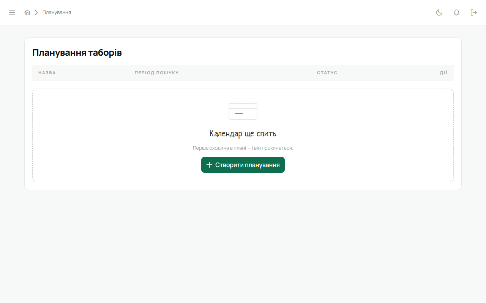

«Планування» у сайдбарі — для Звʼязкового і курінного. Відповідає на одне питання: коли провести
табір, щоб зібрати якнайбільше КВ.

## Як це працює

1. **Нове планування.** Назва, період, у якому шукаємо дату, тривалість табору в днях.
2. **Учасники.** Підтягуються всі з КВ куреня. Для кожного познач дні, коли людина зайнята, і
   **важливість** присутності — Звʼязковий важить більше за новачка.
3. **Підібрати.** Система перебирає варіанти і повертає дату з найменшою «ціною» конфліктів: 0 —
   усі вільні, більше — довелося кимось пожертвувати. Видно, хто саме не зможе.
4. **У календар.** Одним кліком результат стає подією з групою «табори».

Сесії планування зберігаються: можна повернутися, змінити зайнятість і перерахувати.

