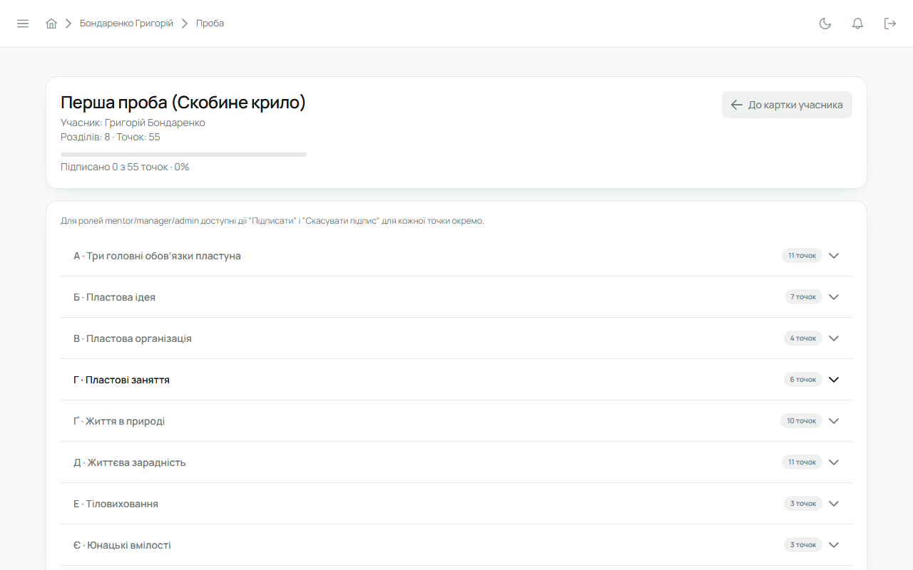
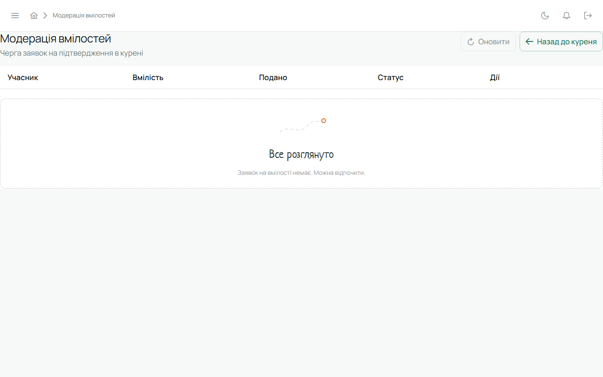

Вимоги проб і перелік вмілостей у Лілейці беруться з офіційних програм Пласту і оновлюються
самі — вручну їх заводити не треба.

## Проба

У картці юнака відкрий пробу: перелік точок із станом кожної. Впорядник гуртка або провід куреня
підписує точку — лишається імʼя й дата, юнак отримує сповіщення. Підпис можна зняти; це теж
пишеться в журнал, тож історія завжди повна.

Юнак бачить свою пробу в «Мій профіль», але підписувати не може.

## Вмілості

1. Юнак або впорядник подає вмілість на розгляд у картці юнака.
2. Вона зʼявляється в **«Модерація вмілостей»** у сайдбарі впорядника і проводу куреня.
3. Там її підтверджують або повертають із коментарем.

Здобуті вмілості видно в картці зі значком і датою.

## Журнал

Кожна зміна поступу — підпис, зняття, подання, підтвердження — зберігається з тим, хто і коли.
Це видно в картці і потрапляє в PDF-звіт.

## Права

| Дія | Впорядник | Провід куреня |
|---|---|---|
| підписати точку | у своєму гуртку | у всьому курені |
| розглянути вмілість | у своєму гуртку | у всьому курені |
