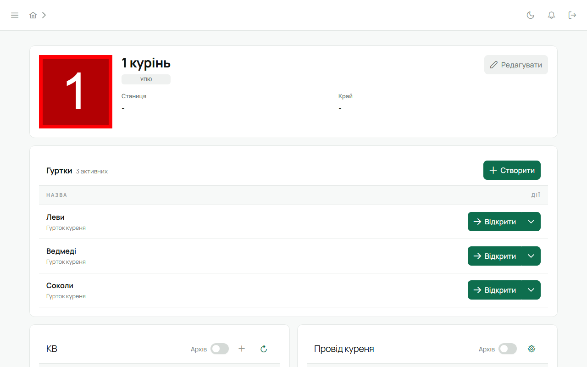
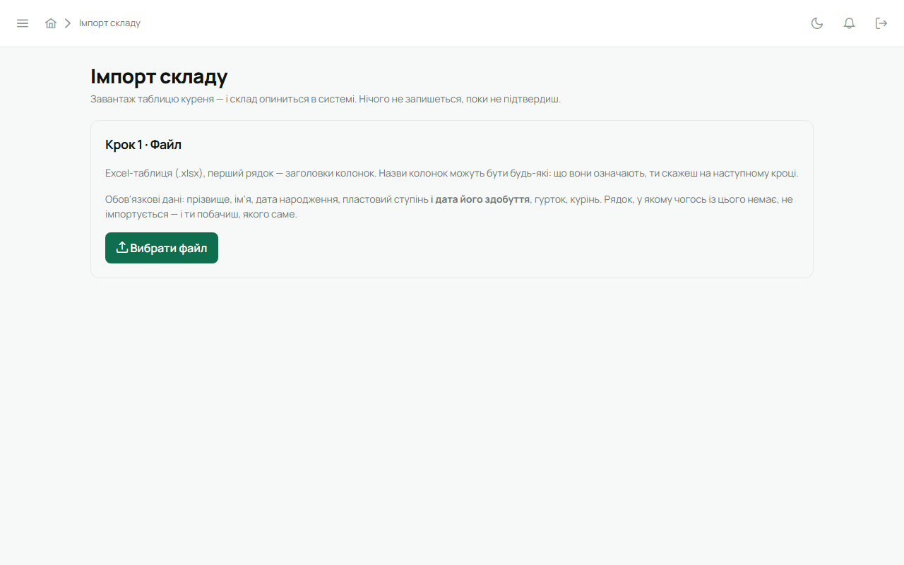
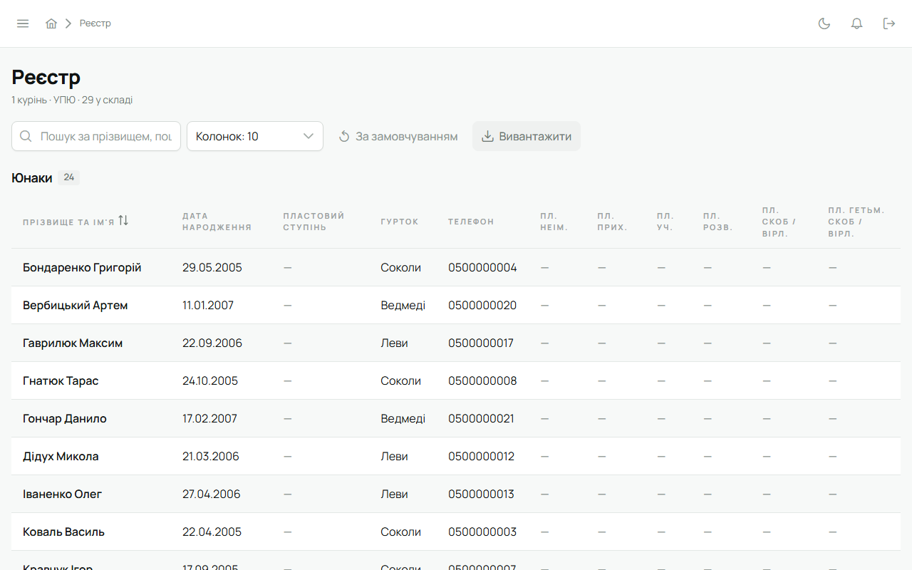
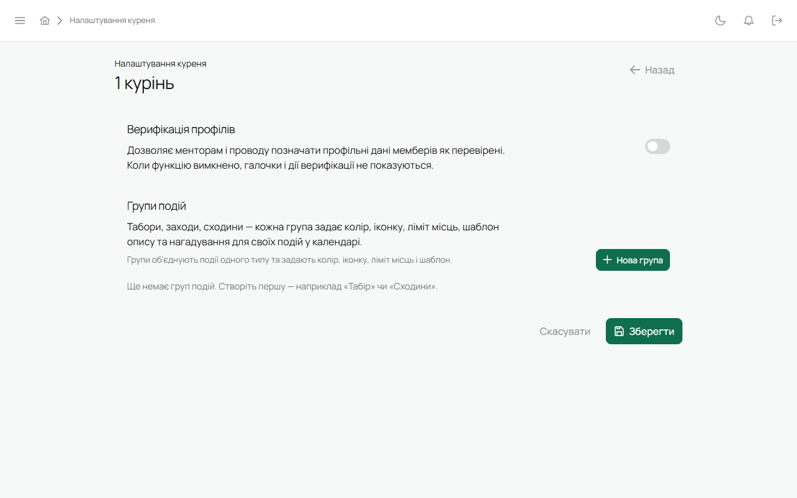

Звʼязковий бачить і веде весь курінь. Тут — порядок дій від порожнього куреня до робочого.

## 1. Гуртки

На головній сторінці куреня — «Створити гурток». Назва, за бажанням опис і сильветка. Гуртки
можна створювати і в момент імпорту: система запропонує відкрити ті, яких ще немає.

## 2. Склад: імпорт із таблиці

«Імпорт складу» в сайдбарі. Три кроки:

1. **Файл.** Excel або CSV з наявного реєстру. Одна людина — один рядок.
2. **Що є що.** Система вгадує, яка колонка означає прізвище, імʼя, дату народження, ступінь, гурток,
   пошту, телефон. Виправ, де вгадала не так. Обовʼязкові: прізвище, імʼя, дата народження, гурток.
3. **Що станеться.** Перед записом видно по кожному рядку: нова людина, долучення того, хто вже є в
   системі (збіг за поштою чи телефоном), уже в курені, відхилено і чому.

**Рядок із поштою отримує акаунт** і лист із активацією. Тому пошта в таблиці має бути актуальною,
а людей варто попередити перевірити «Спам».

Руками: «Додати учасника куреня» на головній або в гуртку.

## 3. Провід куреня і КВ

- **Провід куреня** — курінний, скарбник, писар та інші уряди з датами каденцій. Історія
  зберігається: хто коли що тримав.
- **КВ** (кадра виховників) — на головній сторінці куреня. «Додати впорядника»: обери людину з
  акаунтом і гуртки, які вона вестиме. З цього моменту вона впорядник — з правами на свої гуртки.
- **Передати роль звʼязкового** — там же. Ти стаєш впорядником, обрана людина — Звʼязковим.

Права йдуть саме звідси: змінив провід — змінилися права, при наступному вході людини.

## 4. Прийняти за кодом

Юнак з іншого куреня приходить зі своїм публічним кодом `PL-…`. На головній сторінці куреня —
«Прийняти за кодом»: вкажи код і гурток. Людина стає членом твого куреня, історія попередніх
куренів лишається в її картці.

## 5. Реєстр

«Реєстр» у сайдбарі: юнаки і впорядники, пошук, сортування, ступені. Експорт у таблицю — кнопкою
вгорі. Колишні члени куреня видні окремо.

## 6. Календар, задачі, планування

- Календар і задачі — як у впорядника, але на весь курінь: групи подій (табори, заходи, сходини)
  налаштовуються в налаштуваннях куреня.
- **Планування** — підбір дати табору. Створи сесію, вкажи період пошуку і тривалість; для кожного
  з КВ познач зайняті дні й важливість присутності. Система підбере дату з найменшими конфліктами,
  а результат одним кліком стає подією календаря.

## 7. Налаштування куреня

«Налаштування куреня»: верифікація профілів (увімкнути чи вимкнути для куреня), групи подій
календаря, дані куреня.

## 8. PDF-звіт

На головній сторінці куреня — експорт звіту: склад, гуртки, провід, ступені, з датою і версією
системи. Для інституційної памʼяті: раз на пів року зберегти файл — і курінь не залежить від
жодного сервісу.

## 9. Безпека

Тобі обовʼязковий двофакторний вхід — див. [Акаунт і безпека](/user/account/). Резервні коди
зберігай окремо від телефона.
