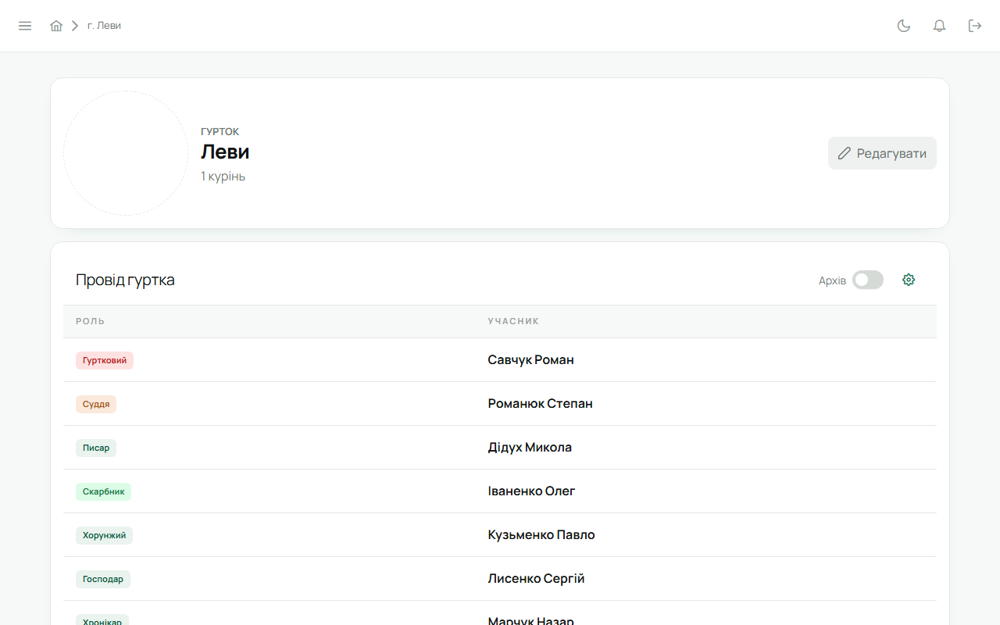

Впорядник — той, кого Звʼязковий закріпив за гуртком. Усе нижче стосується **твоїх** гуртків; інші
видно, але не редагуються.

## Сторінка гуртка

Відкривається з головної сторінки куреня або з реєстру. Тут склад гуртка, впорядники, сильветка,
опис, дні народження найближчих 30 днів.

- **Додати учасника** — форма нового учасника: імʼя, пошта, телефон, дата народження, ступінь.
  На пошту одразу піде запрошення з активацією; попроси перевірити «Спам».
- **Редагувати** — та сама форма для наявного учасника; тут же фото (з обрізанням), ступені,
  адреса, школа.
- **Сильветка** — завантаж зображення; є кругове обведення і чорно-білий фільтр.

## Проба

Відкрий картку юнака → проба. Кожна точка має кнопку «підписати»; підпис лишає твоє імʼя й дату,
юнак отримує сповіщення. Знята точка теж пишеться в журнал — історія не губиться.

## Вмілості

Юнак або ти подаєте вмілість на розгляд; черга видна в «Модерація вмілостей» у сайдбарі. Там
підтвердь або поверни з коментарем. Каталог вмілостей і вимоги — з офіційних програм Пласту,
оновлюються самі.

## Календар і задачі

- **Календар** — сходини, табори й заходи. Створюючи подію, вкажи, для кого вона: гурток, курінь чи
  конкретні люди. Є повтори (щотижневі сходини) і відповіді «буду / не буду».
- **Задачі** — дошка задач гуртка: призначити юнакові, поставити термін, відмітити зроблене.

## Відзначення й перестороги

У картці юнака: відзначення (з датою й підставою) і перестороги (рівень, причина). Обидва
приходять юнакові сповіщенням.

## Верифікація профілів

Якщо в курені увімкнена верифікація, у картці є позначка «перевірено». Перевір дані юнака і
підтверди; якщо потім зміниться щось суттєве, позначка стане «застаріла» і попросить переглянути
ще раз. Дрібні правки позначку не збивають.

## Чого впорядник не може

Змінювати провід куреня, закріплення впорядників, налаштування куреня, імпортувати склад у
курінь, експортувати PDF-звіт. Це — [Звʼязковий](/user/roles/leader/).
