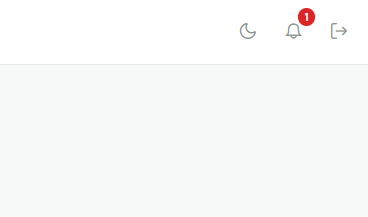
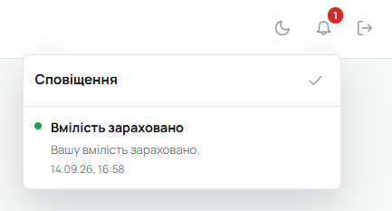

Ти заходиш у Лілейку за запрошенням від впорядника чи Звʼязкового: на пошту приходить лист, далі — пароль і ти всередині.

## Мій профіль

У бічній панелі є «Мій профіль» — твоя картка учасника. Тут:

- фото, ступінь і історія ступенів, гурток і курінь;
- **проба** — які точки вже підписані, які ні; кожна точка має підпис того, хто її прийняв;
- **вмілості** — здобуті і ті, що на розгляді. Ти можеш подати вмілість, а впорядник розгляне і підтвердить;
- **відзначення** і, якщо були, **перестороги**. Відзначення ти можеш теж подати сам на розгляд впорядника. Перестороги призначає сам впорядник чи зв'язковий;

Свої контактні дані можна змінити в [налаштуваннях акаунта](/user/account/), а також в редагуванні профіля.

## Реєстр і гурток

Реєстр куреня і сторінка гуртка відкриті для певних членів проводу: видно, хто в якому гуртку, хто впорядник, які ступені переважають в курені.

## Календар і задачі

Календар куреня показує сходини, табори й заходи, які стосуються тебе, твого гуртка або всього куреня. На подію можна відповісти «буду / не буду». У задачах видно те, що призначено тобі особисто чи твоєму гуртку.

## Сповіщення

Дзвіночок угорі: коли впорядник підписав точку, розглянув вмілість, додав відзначення чи
пересторогу — тут зʼявиться повідомлення з переходом на потрібну сторінку.

## Гуртковий провід

Якщо ти гуртковий, писар чи господарник — це записано у проводі гуртка і видно в реєстрі.

