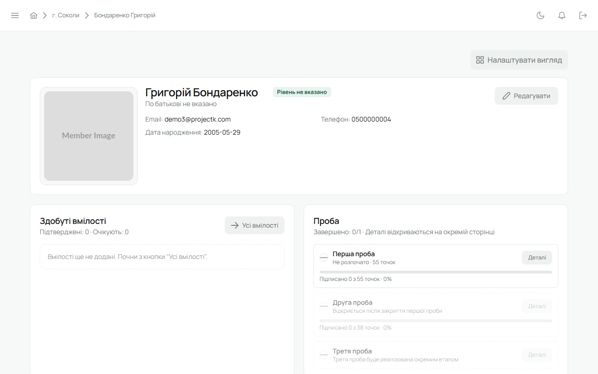

Юнак заходить у Лілейку за запрошенням від впорядника чи Звʼязкового: на пошту приходить лист,
далі — пароль і ти всередині.

## Мій профіль

У сайдбарі є «Мій профіль» — твоя картка учасника. Тут:

- фото, ступінь і історія ступенів, гурток і курінь;
- **проба** — які точки вже підписані, які ні; кожна точка має підпис того, хто її прийняв;
- **вмілості** — здобуті і ті, що на розгляді;
- **відзначення** і, якщо були, **перестороги**;
- **твій код** — публічний код вигляду `PL-XXXX-XXXX`. Якщо переходиш в інший курінь, назви цей код
  його Звʼязковому: він «прийме за кодом», і твоя історія піде з тобою.

Свої контактні дані можна змінити в [налаштуваннях акаунта](/user/account/); імʼя, ступінь і
гурток веде провід.

## Реєстр і гурток

Реєстр куреня і сторінка гуртка відкриті всім членам куреня: видно, хто в якому гуртку, хто
впорядник, у кого скоро день народження. Редагувати чужі картки юнак не може.

## Календар і задачі

Календар куреня показує сходини, табори й заходи, які стосуються тебе, твого гуртка або всього
куреня. На подію можна відповісти «буду / не буду». У задачах видно те, що призначено тобі
особисто чи твоєму гуртку.

## Сповіщення

Дзвіночок угорі: коли впорядник підписав точку, розглянув вмілість, додав відзначення чи
пересторогу — тут зʼявиться повідомлення з переходом на потрібну сторінку.

## Гуртковий провід

Якщо ти гуртковий, писар чи господар — це записано у проводі гуртка і видно в реєстрі, але прав
на редагування це не додає: вести гурток у системі може впорядник.
