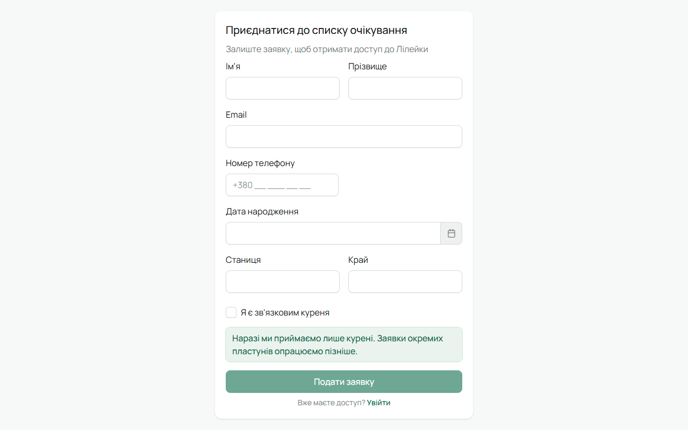
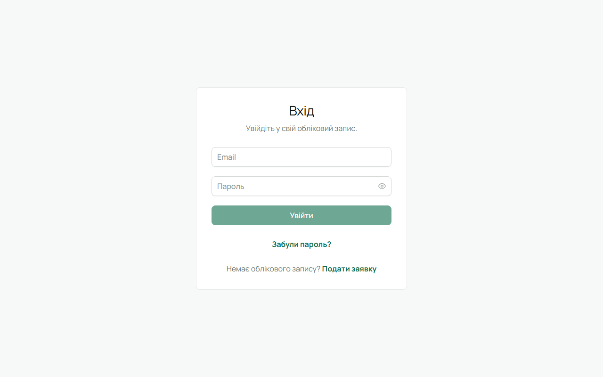

## 1. Заявка від куреня

Лілейка зараз приймає **курені**, не окремих пластунів. Заявку подає Звʼязковий на сторінці
«Приєднатися»: імʼя, пошта, телефон, станиця, край і **число куреня**. Без прапорця «Я є звʼязковим
куреня» кнопка не активна — це свідомо.

Після подачі приходить підтвердження на екрані. Далі заявку переглядає адміністратор системи.

## 2. Лист із запрошенням

Коли заявку схвалено, на вказану пошту приходить лист «Лілейка · запрошення до системи» із зеленою
кнопкою «Активувати акаунт». Посилання діє 7 днів.

:::caution[Перевір «Спам»]
Листи від Лілейки іноді потрапляють у «Спам» чи «Промоакції». Якщо листа не видно — загляни туди
і додай відправника до контактів.
:::

Якщо посилання прострочилось — на сторінці входу натисни «Забули пароль?» і вкажи ту саму
адресу: система надішле нове запрошення.

## 3. Пароль

За посиланням відкривається сторінка активації з твоїм імʼям і поштою. Обери пароль (від 8
символів, індикатор підкаже надійність), повтори його — і ти одразу в системі, у своєму курені.
Окремо заходити не треба.

## 4. Другий фактор для проводу

Звʼязковому й адміністратору система вимагає **двофакторний вхід** (MFA). При першому вході
зʼявиться вікно з QR-кодом:

1. Встанови застосунок-автентифікатор (Google Authenticator, Microsoft Authenticator, Aegis тощо).
2. Відскануй QR-код або введи ключ вручну.
3. Введи шестизначний код із застосунку.
4. **Збережи резервні коди** — кожен спрацьовує один раз, якщо телефон загубиться.

Далі при вході після пароля система спитає код. На тому самому пристрої вона запамʼятає тебе на
**7 днів**: вихід і повторний вхід протягом тижня коду не вимагають. Новий пристрій — знову з кодом.

Юнаки та впорядники можуть увімкнути MFA за бажанням у [налаштуваннях акаунта](/user/account/).

## 5. Що далі

- Звʼязковий: [завести курінь](/user/roles/leader/) — гуртки, склад, провід.
- Впорядник: [свій гурток](/user/roles/mentor/).
- Юнак: [своя картка](/user/roles/youth/).
