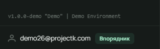

У Лілейці немає окремих «прав», які хтось видає вручну. Є **діловодства** — ті самі, що в курені: Звʼязковий,
впорядник, курінний, скарбник, гуртковий і так далі. Провід куреня записує, хто яке діловодство тримає, і система з
цього сама виводить, що людині можна. Змінилось діловодство — змінилися права, при наступному вході.

// Як це зробити?

## Хто що може

| Дія | Юнак | Гуртковий | Впорядник | Курінний / скарбник | Звʼязковий | Адміністратор |
|---|:-:|:-:|:-:|:-:|:-:|:-:|
| бачити свою картку, пробу, вмілості | ✓ | ✓ | ✓ | ✓ | ✓ | ✓ |
| редагувати свій профіль і акаунт | ✓ | ✓ | ✓ | ✓ | ✓ | ✓ |
| бачити реєстр куреня | | ✓ | ✓ | ✓ | ✓ | ✓ |
| редагувати учасників свого гуртка | | | ✓ | | ✓ | ✓ |
| підписувати точки проби, розглядати вмілості | | | у своєму гуртку | | у всьому курені | ✓ |
| вести календар і задачі гуртка | | | ✓ | | ✓ | ✓ |
| додавати учасників, імпортувати склад | | | ✓ (у гурток) | | ✓ | ✓ |
| провід куреня, КВ, закріплення впорядників | | | | | ✓ | ✓ |
| налаштування куреня, планування, PDF-звіт | | | | ✓ (планування) | ✓ | ✓ |
| заявки, користувачі, системні налаштування | | | | | | ✓ |

## Впорядник закріплений за гуртком

Впорядник у Лілейці — той, кого Звʼязковий закріпив за гуртком на сторінці куреня - «Налаштування
впорядника». Одна людина може вести кілька гуртків, у гуртка може бути кілька впорядників. Ролі
впорядника без гуртка не буває.

// Як це зробити?

## Кілька куренів (заплановано, нереалізовано)

Людина може стояти в кількох куренях одночасно, і в кожному тримати свій уряд. При вході система
відкриває той курінь, де в людини є уряд, а перемкнутися можна у меню зверху.

## Позначки в бічній панелі

Внизу бічної панелі видно твоє діловодство у поточному курені (наприклад «Впорядник» або «Звʼязковий»). Це те, з чого рахуються права саме зараз.

