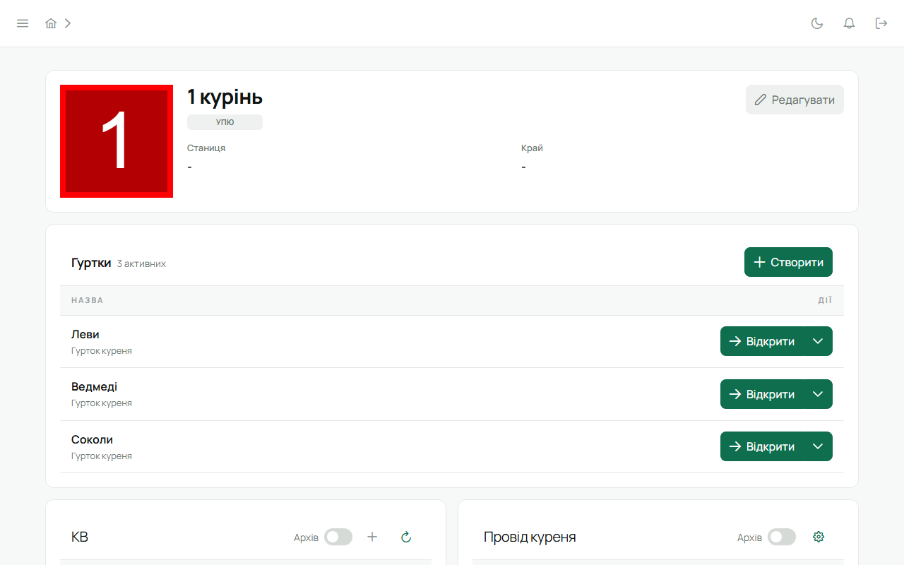

Лілейка — це веб-додаток для куреня УПЮ. Він тримає в одному місці те, що зазвичай розкидане по
таблицях, чатах і чиїйсь памʼяті: склад куреня, гуртки, провід, прогрес проб і вмілостей,
календар сходин і таборів, задачі. Кожен бачить те, що стосується його, і рівно стільки, скільки
дозволяє його діловодство.

## Для кого

- **Для юнака** — своя картка: проба з точками, вмілості, відзначення. Видно, що вже здобуто і що робити далі.
- **Для впорядника** — гурток під рукою: підписати точку проби, розглянути вмілість, запланувати та провести сходини за календарем.
- **Звʼязковому** — весь курінь: реєстр з історією, провід, КВ, календар і планування, імпорт складу куреня
  з наявної таблиці, звіт у PDF.
- **Станиці** — систему можна поставити на власний сервер і тримати дані у себе.

## Що всередині

| Розділ | Що там |
|---|---|
| [Головна](/user/features/dashboard/) | твої події, задачі й справи з усіх куренів; для юнака — проба, вмілості, вкладка, бали |
| Курінь | сторінка куреня: гуртки, провід, КВ |
| Реєстр | усі юнаки й впорядники куреня в одній таблиці, з експортом |
| Гурток | склад гуртка, впорядники, сильветка, дні народження |
| Картка учасника | фото, ступені, проба й вмілості, відзначення, перестороги, історія куренів |
| Календар і задачі | сходини, табори, заходи; задачі для гуртка, куреня чи людини |
| Планування | підбір дати табору за зайнятістю виховників |
| [Вкладка](/user/features/dues/) | каса гуртка й куреня: ставки, внески, передачі, баланс кожного юнака |
| [Точкування](/user/features/score/) | присутність на подіях, бали вручну й автоматично, таблиця гуртків, книга КВ |
| Модерація вмілостей | черга вмілостей, поданих на розгляд |
| Налаштування акаунта | пошта, пароль, двофакторний вхід |

## Чого поки немає

Станиця як окремий рівень і власні сторінки куренів УСП та УПС. Лілейка свідомо робить мало,
але надійно. Якщо буде великий інтерес - система буде розширюватися.

## Спробувати без заявки

На сайті є [демо-курінь](/demo/), що дасть змогу подивитися на систему з обмеженим функціоналом. Обери, ким зайти — Звʼязковим,
впорядником чи юнаком — і понатискай. Зміни там не зберігаються.
